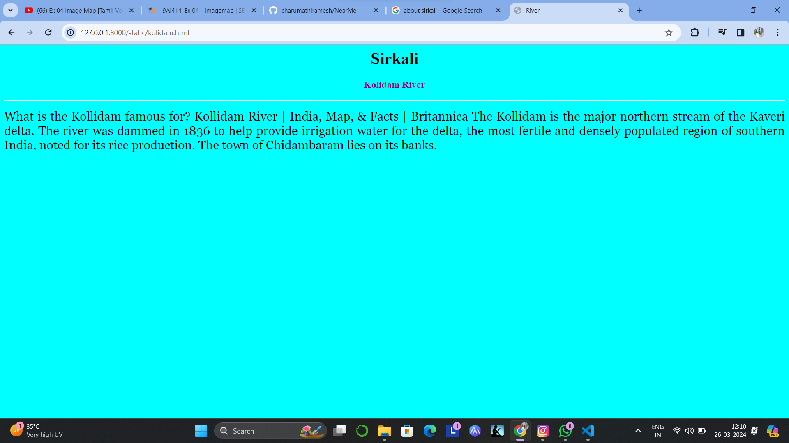
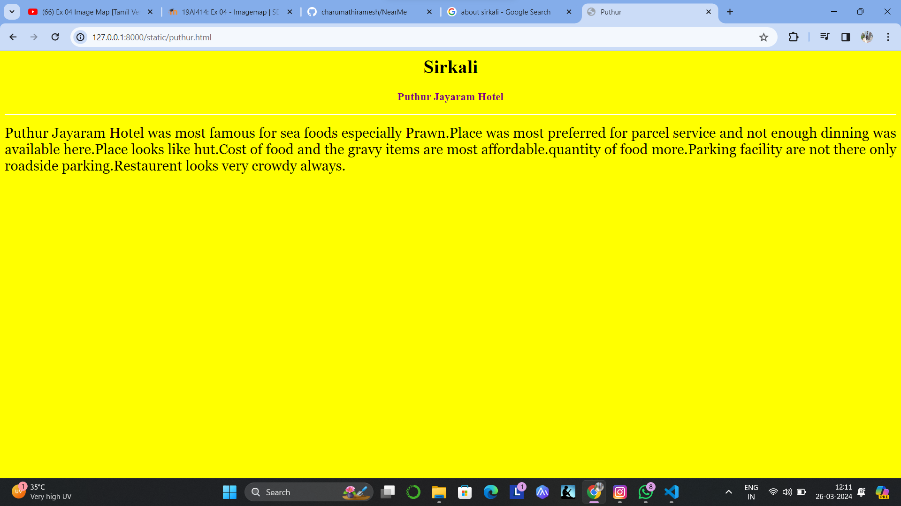
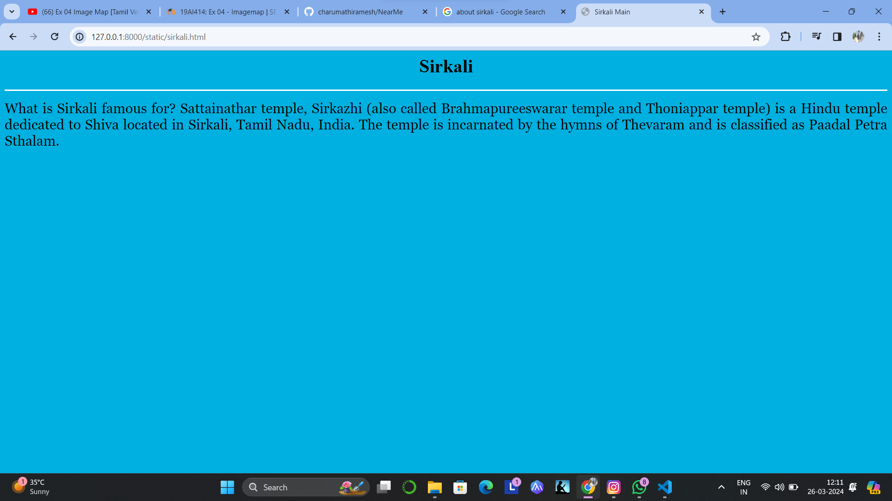
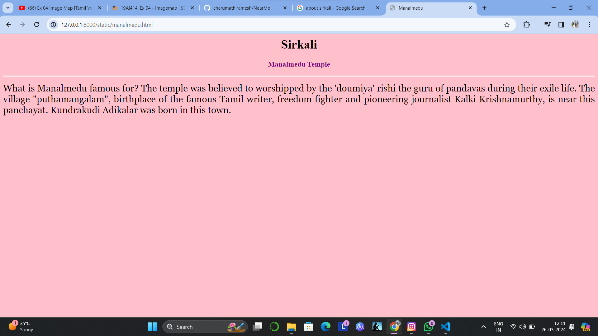
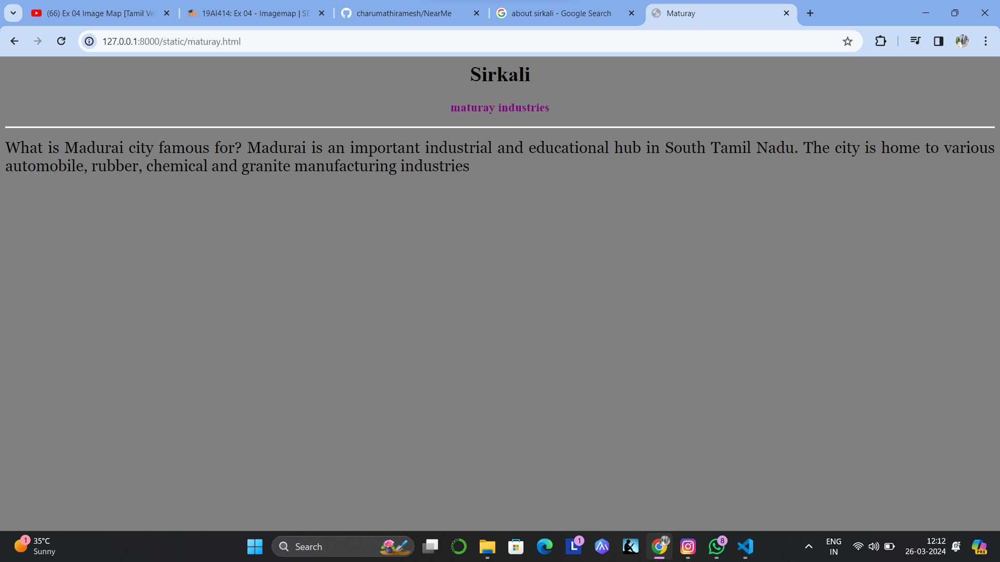

# Ex04 Places Around Me
## Date: 26-03-2024

## AIM
To develop a website to display details about the places around my house.

## DESIGN STEPS

### STEP 1
Create a Django admin interface.

### STEP 2
Download your city map from Google.

### STEP 3
Using ```<map>``` tag name the map.

### STEP 4
Create clickable regions in the image using ```<area>``` tag.

### STEP 5
Write HTML programs for all the regions identified.

### STEP 6
Execute the programs and publish them.

## CODE
```
map.html
<html>
<head>
<title>My City</title>
</head>
<body>
<h1 align="center">
<font color="green"><b>Sirkali</b></font>
</h1>
<h3 align="center">
<font color="purple"><b>Hafeezul Deen S (212223220028)</b></font>
</h3>
<center>


<map name="image-map">
    <area target="" alt="Puthur" title="Puthur" href="puthur.html" coords="989,240,1054,289" shape="rect">
    <area target="" alt="Maturay" title="Maturay" href="maturay.html" coords="332,715,401,752" shape="rect">
    <area target="" alt="Manalmedu" title="Manalmedu" href="manalmedu.html" coords="542,575,644,629" shape="rect">
    <area target="" alt="Sirkali" title="Sirkali" href="sirkali.html" coords="1067,399,1144,458" shape="rect">
    <area target="" alt="Kolidam" title="Kolidam" href="kolidam.html" coords="1008,87,1091,122" shape="rect">
</map>
</center>
</body>
</html>

kolidam.html
<html>
    <head>
        <title>River</title>
    </head>
    <body bgcolor="cyan">
    <h1 align="center">
    <font color="black"><b>Sirkali</b></font>
    </h1>
    <h3 align="center">
    <font color="purple"><b>Kolidam River</b></font>
    </h3>
    <hr size="3" color="white">
    <p align="justify">
    <font face="Georgia" size="5">
        What is the Kollidam famous for?
Kollidam River | India, Map, & Facts | Britannica
The Kollidam is the major northern stream of the Kaveri delta. The river was dammed in 1836 to help provide irrigation water for the delta, the most fertile and densely populated region of southern India, noted for its rice production. The town of Chidambaram lies on its banks.
    </font>
    </p>
    </body>
</html>

manalmedu.html

<html>
    <head>
        <title>Manalmedu</title>
    </head>
    <body bgcolor="pink">
    <h1 align="center">
    <font color="black"><b>Sirkali</b></font>
    </h1>
    <h3 align="center">
    <font color="purple"><b>Manalmedu Temple</b></font>
    </h3>
    <hr size="3" color="white">
    <p align="justify">
    <font face="Georgia" size="5">
        What is Manalmedu famous for?
        The temple was believed to worshipped by the 'doumiya' rishi the guru of pandavas during their exile life. The village "puthamangalam", birthplace of the famous Tamil writer, freedom fighter and pioneering journalist Kalki Krishnamurthy, is near this panchayat. Kundrakudi Adikalar was born in this town.
    </font>
    </p>
    </body>
</html>

maturay.html
<html>
    <head>
        <title>Maturay</title>
    </head>
    <body bgcolor="gray">
    <h1 align="center">
    <font color="black"><b>Sirkali</b></font>
    </h1>
    <h3 align="center">
    <font color="purple"><b>maturay industries</b></font>
    </h3>
    <hr size="3" color="white">
    <p align="justify">
    <font face="Georgia" size="5">
        What is Madurai city famous for?
        Madurai is an important industrial and educational hub in South Tamil Nadu. The city is home to various automobile, rubber, chemical and granite manufacturing industries
    </font>
    </p>
    </body>
</html>

puthur.html
<html>
    <head>
        <title>Puthur</title>
    </head>
    <body bgcolor="Yellow">
    <h1 align="center">
    <font color="black"><b>Sirkali</b></font>
    </h1>
    <h3 align="center">
    <font color="purple"><b>Puthur Jayaram Hotel</b></font>
    </h3>
    <hr size="3" color="white">
    <p align="justify">
    <font face="Georgia" size="5">
        Puthur Jayaram Hotel was most famous for sea foods especially Prawn.Place was most preferred for parcel service and not enough dinning was available here.Place looks like hut.Cost of food and the gravy items are most affordable.quantity of food more.Parking facility are not there only roadside parking.Restaurent looks very crowdy always.
    </font>
    </p>
    </body>
</html>

sirkali.html
<html>
    <head>
        <title>Sirkali Main</title>
    </head>
    <body bgcolor="sky blue">
    <h1 align="center">
    <font color="black"><b>Sirkali</b></font>
    </h1>
    <h3 align="center">
    <font color="purple"><b></b></font>
    </h3>
    <hr size="3" color="white">
    <p align="justify">
    <font face="Georgia" size="5">
        What is Sirkali famous for?
Sattainathar temple, Sirkazhi (also called Brahmapureeswarar temple and Thoniappar temple) is a Hindu temple dedicated to Shiva located in Sirkali, Tamil Nadu, India. The temple is incarnated by the hymns of Thevaram and is classified as Paadal Petra Sthalam.
    </font>
    </p>
    </body>
</html>
```

## OUTPUT








## RESULT
The program for implementing image maps using HTML is executed successfully.
